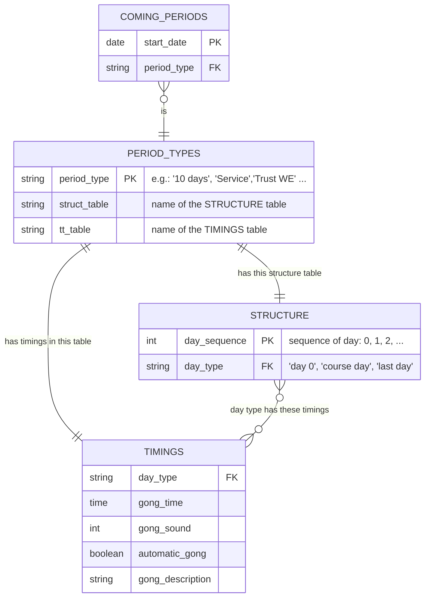
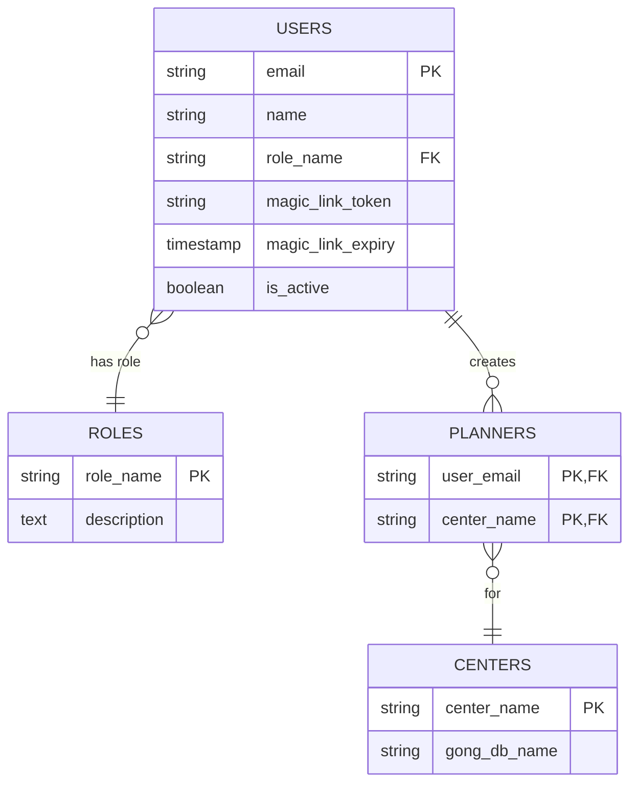

# Database design

### Gong databases

One gong database is used to store the gong planning data for each center. Each gong database name is referenced in the CENTERS table in the Admin database below.
All gong databases have the same structure detailed here below, but their content will vary from center to center.

As of today, this app is managing the gong planning for:

- Dhamma Mahi (mahi.db)
- Dhamma Pajjota (pajjota.db)

TODO describe the entities

### Admin database

The admin database is used to manage users, centers, and planners for gong planning. It has the following entities:

ROLES:
- admin for modifying USERS / CENTERS / PLANNERS, and also gong planning 
- user for gong planning only

USERS:
- authenticated by sending a "magic link" to their email address : see "authenticate.md"

CENTERS:
- with the gong database name for this center

PLANNERS:
- indicates which user(s) can modify the gong planning of which center 

