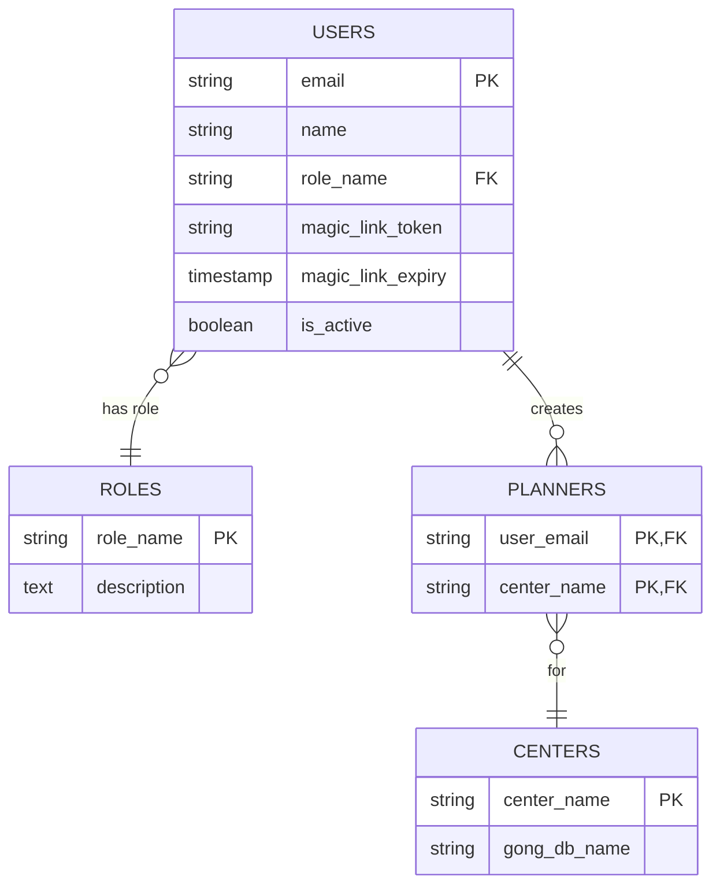
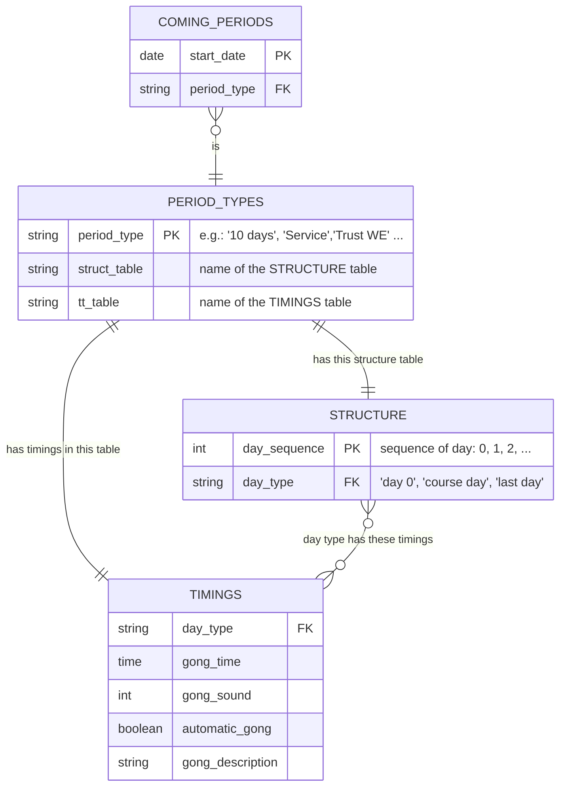

# Data definitions and databases


``` {.python #data-defi-db-md}

<<setup-database>>
<<initialize-database>>
```

### Admin database

The admin database is used to manage users, centers, and planners for gong planning. It has the following entities:

ROLES:
- admin for modifying USERS / CENTERS / PLANNERS, and also gong planning 
- user for gong planning only

USERS:
- authenticated by sending a "magic link" to their email address : see "authenticate.md"

CENTERS:
- with the gong database name for this center

PLANNERS:
- indicates which user(s) can modify the gong planning of which center 



### Gong databases

One gong database is used to store the gong planning data for each center. Each gong database name is referenced in the CENTERS table above.
All gong databases have the same structure detailed here below, but their content will vary from center to center.

As of today, this app is managing the gong planning for:

- Dhamma Mahi (mahi.db)
- Dhamma Pajjota (pajjota.db)


TODO describe the entities




### Database setup

``` {.python #setup-database}

db = database('data/gongUsers.db')

SQL_CREATE_ROLES = """
CREATE TABLE IF NOT EXISTS roles (
    role_name TEXT PRIMARY KEY,
    description TEXT
);
"""

SQL_CREATE_CENTERS = """
CREATE TABLE IF NOT EXISTS centers (
    center_name TEXT PRIMARY KEY,
    gong_db_name TEXT
);
"""

SQL_CREATE_USERS = """
CREATE TABLE IF NOT EXISTS users (
    email TEXT PRIMARY KEY,
    name TEXT,
    role_name TEXT,
    magic_link_token TEXT,
    magic_link_expiry TIMESTAMP,
    is_active BOOLEAN DEFAULT FALSE,
    FOREIGN KEY (role_name) REFERENCES roles(role_name)
);

"""

SQL_CREATE_PLANNERS = """
CREATE TABLE IF NOT EXISTS planners (
    user_email TEXT,
    center_name TEXT,
    PRIMARY KEY (user_email, center_name),
    FOREIGN KEY (user_email) REFERENCES users(email),
    FOREIGN KEY (center_name) REFERENCES centers(center_name)
);
"""

db.execute(SQL_CREATE_ROLES)
db.execute(SQL_CREATE_CENTERS)
db.execute(SQL_CREATE_USERS)
db.execute(SQL_CREATE_PLANNERS)

users = db.t.users
roles = db.t.roles
centers = db.t.centers
planners = db.t.planners

Role = roles.dataclass()
Center = centers.dataclass()
Planner = planners.dataclass()
User = users.dataclass()
```
### Database initialization

Check if any table(s) is(are) empty and insert default values if needed

``` {.python #initialize-database}

if not roles():
    roles.insert(role_name="admin", description="administrator")
    roles.insert(role_name="user", description="regular user")

if not centers():
    centers.insert(center_name="Mahi", gong_db_name="mahi.db")
    centers.insert(center_name="Pajjota", gong_db_name="pajjota.db")

if not users():
    users.insert(email="spegoff@authentica.eu", name="sp1", role_name="admin", is_active=True, magic_link_token=None, magic_link_expiry=None)
    users.insert(email="spegoff@gmail.com", name="sp2", role_name="user", is_active=True)

if not planners():
    planners.insert(user_email= "spegoff@authentica.eu", center_name= "Mahi")
    planners.insert(user_email= "spegoff@gmail.com", center_name= "Pajjota")
```
