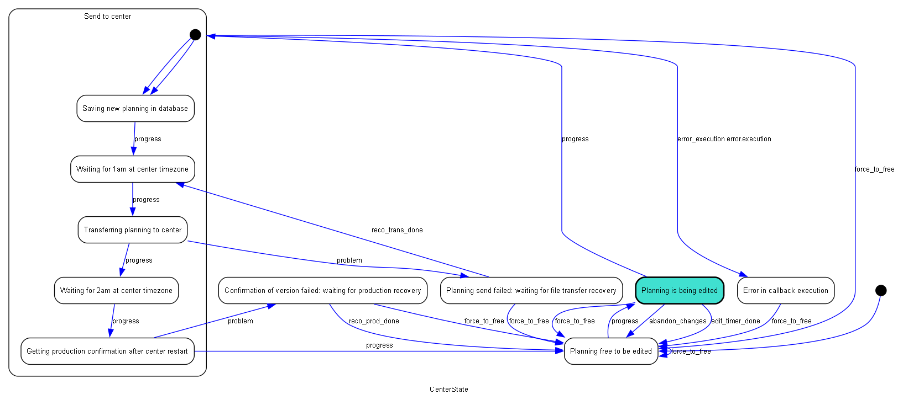

# State machine - for centers

## Synchronisation between Rasperry Pi and web program

Synchro by reading and writing files on a shared S3 server [Minio](storage-minio.md): 

- Server public endpoint : bucket-production-6009.up.railway.app:443
- Bucket : dhamma-gong-database

#### 00h40 : Web program

Writes the new center gong db file in the bucket

- f"{center_name}/sending{file-ISO_date}.db"
- example: mahi/sending2024-04-09.db

#### 01h00 : Rasperry Pi 

- reads the file if it is there
- IF the file is there
    - IF the date in the file name is today's date
        - restarts with the new db file
        - writes this file in the bucket:  
          f"{center_name}/received{file-ISO_date}.db"
    - ELSE # dates do not match
        - restarts on the same db as before
- ELSE # no file there
    - restarts on the same db as before

#### 01h20 : Web program

- checks if the file f"{center_name}/received{file-ISO_date}.db" exists
- IF the file is there
    - delete the file
    - updates the master db file for the center with the new db file
    - updates the date for the version in the center computer
    - sends an 'OK' email to the center admin(s)
- ELSE # no file there
    - sends a 'NOT OK' email to the center admin(s)

## State machine for center state (and data) management 

The status of a center data is managed with a state machine. The state is persisted into the center table of the central gongUsers database, using an abstract model and a database persistent model.

```python
#| file: libs/states.py

from abc import ABC
from abc import abstractmethod
import asyncio
from fasthtml.common import *
from datetime import datetime, timezone
from statemachine import State, Event, StateChart
from statemachine.orderedset import OrderedSet
import libs.transit as transit
import libs.utils as utils

csms = {}
clocks = {}

<<state-machine>>
<<abstract-with-persistency>>
<<db-persistent-model>>
<<create-centers-sms>>
```
### The state machine for each center

see: https://python-statemachine.readthedocs.io/en/latest/index.html

```python
#| id: state-machine

class HistoryListener:
    def __init__(self, model):
        self.max_size = 30
        self.model = model
        self.entries = []

    def after_transition(self, event, source, target):
        model = self.model
        result_mess = f" with: {model.last_result}" if model.last_result else ""
        log = f"At {model.get_center_attr("status_start")}, {model.get_center_attr("created_by")} moved {model.center_name} " + \
            f"from {source.id} to {target.id} on {event}" + result_mess
        # to {target.id} or {self.model.get_status_stri()}
        self.entries.append(log)
        print(log)
        if len(self.entries) > self.max_size:
            self.entries.pop(0)

class CenterState(StateChart["CenterDataModel"]):

    allow_event_without_transition = False
    atomic_configuration_update = True

    class send_to_center(State.Compound):

        save_db = State("Saving new planning in database", initial=True)
        wait_01 = State("Waiting for 1am at center timezone")
        transfer = State("Transferring planning to center") 
        wait_02 = State("Waiting for 2am at center timezone")
        getting_prod = State("Getting production confirmation after center restart")

        progress = save_db.to(wait_01) | wait_01.to(transfer) | transfer.to(wait_02) \
            | wait_02.to(getting_prod)


    edit = State("Planning is being edited")
    w_reco_trans = State("Planning send failed: waiting for file transfer recovery")
    w_reco_prod = State("Confirmation of version failed: waiting for production recovery")
    errorex = State("Error in callback execution")
    free = State("Planning free to be edited", initial=True)

    progress = free.to(edit) | edit.to(send_to_center) | send_to_center.getting_prod.to(free)
    problem  = send_to_center.transfer.to(w_reco_trans) | send_to_center.getting_prod.to(w_reco_prod)

    abandon_changes   = Event(edit.to(free), name='user abandon changes')
    edit_timer_done   = Event(edit.to(free), name='1 hour edit timer elapsed')
    reco_trans_done   = Event(w_reco_trans.to(send_to_center.wait_01), name='recovery of file transfer done')
    reco_prod_done    = Event(w_reco_prod.to(free), name='recovery of db in production done')

    # used only in dev mode: force to free transitions
    force_to_free = free.from_.any()

    error_execution = send_to_center.to(errorex, on="printerror")

    # ACTIONS ---------------------------------

    async def printerror(self, error):
        # error = erro if erro else "NO ERROR TEXT AVAILABLE"
        self.model.last_result = {"error": f"execution error: {error}"}
        await transit.send_center_email(self.model,'errorex', "ATTENTION: Gong app execution error")

```

The state diagram for the center state machine:



### State machines creation and access

1 state machine per center.  
To create them: csms = init_center_state_machines()  
To access the sm for one center: sm = csms\["Mahi"\]

```python
#| id: create-centers-sms

def delete_state_machine(center_name):
    del csms[center_name]
    del clocks[center_name]

def add_center_state_machine(name, db):
    center_state = CenterDataModel(center_name=name, db=db)
    sm = CenterState(model=center_state)
    center_state.add_machine(sm)
    the_listener = HistoryListener(model=center_state)
    sm.add_listener(the_listener)
    csms[name] = sm
    clocks[name] = asyncio.Lock()

def init_center_state_machines(db):
    centers_list = db.t.center()
    names = [c.center_name for c in centers_list]
    for name in names:
        add_center_state_machine(name, db)

```

### DBPersistentModel: Concrete model strategy

A concrete implementation of the generic storage protocol above, that reads and writes to the central database on table centers with center_name in fields:

- status: the current state
- created_by: the user who took ownership of this center database
- status_start: date/time when the status changed (ISO UTC string)

```python
#| id: db-persistent-model
def status_to_stri(status):
    if status is None:
        return None
    elif isinstance(status, OrderedSet):
        return ",".join(str(v) for v in status)
    else:
        return str(status)

def stri_to_status(strin):
    if strin is None:
        return None
    parts = strin.split(",")
    return parts[0] if len(parts) == 1 else OrderedSet(parts)

class CenterDataModel(AbstractPersistentModel):
    def __init__(self, center_name, db,created_by=None):
        super().__init__()
        self.center_name = center_name
        self.db = db
        self.created_by = created_by
        self.state_mach: StateChart = None    # reference to the state machine for initiating transitions
        self.status_start = None    # Cache for the timestamp of the last state change
        self.save_db_filename = None  # new production db filenameto to be sent : 'sending...'
        self.center_save_date = None # date of sending new production version
        self.pi_db_date = None  # confirmed production version date
        self.send_id = None # id of the delayed send for waiting states, to be able to cancel it if needed
        self.last_result = None   # result of the last operation on this machine

    def _read_state(self):
        centers = self.db.t.center
        row = centers[self.center_name]
        self.status_start = row.status_start
        self.created_by = row.created_by
        self.pi_db_date = row.pi_db_date
        self.center_save_date = row.center_save_date
        self.save_db_filename = row.save_db_filename
        return stri_to_status(row.status)

    def _write_state(self, value):
        now_utc = datetime.now(timezone.utc).strftime('%Y-%m-%dT%H:%M:%S+00:00')
        self.status_start = now_utc
        value_stri = status_to_stri(value)
        centers = self.db.t.center
        centers.update(
            center_name = self.center_name, 
            status = value_stri,
            status_start = self.status_start
        )

    def update_attr(self, attr_name, value):
        setattr(self, attr_name, value)
        centers = self.db.t.center
        center_obj = centers[self.center_name]
        row_dict = center_obj.__dict__
        centers.update(row_dict)

    def get_status_stri(self):
        return status_to_stri(self._read_state())

    def get_center_attr(self, attr_name):
        if getattr(self, attr_name) is None:
            centers = self.db.t.center
            center_obj = centers[self.center_name]
            setattr(self, attr_name, getattr(center_obj, attr_name))
        return getattr(self, attr_name)

    def get_admin_planners(self):
        planners = self.db.t.planner
        users = self.db.t.user
        center_planners = planners("center_name = ?", (self.center_name,))
        return [p.user_email for p in center_planners if users[p.user_email].role_name == "admin"]

    # ACTIONS --------------------------

    def add_machine(self, machine):
        self.state_mach = machine

    async def go_next(self, result, delai=1, sendid = None):
        self.last_result = result
        if "success" in result:
            await self.state_mach.send("progress", delay=delai, send_id=sendid)
            return
        else:
            await self.state_mach.send("problem")
            return

    async def on_enter_free(self):
        self.last_result = {"success": "center is free again"}
        self.update_attr(self, "created_by", None)

    async def on_enter_edit(self):
        self.last_result = {"success": "entered edit mode"}

    async def on_enter_save_db(self):
        result = await transit.save_db_plan_times(self)
        return await self.go_next(result)

    async def on_enter_wait_01(self):
        result, delay = await transit.get_delay(self, utils.Globals.WAIT01_HOUR , utils.Globals.WAIT01_MINS)
        self.send_id = f"{self.center_name}_wait01"
        return await self.go_next(result, delay, self.send_id)

    async def on_exit_wait_01(self):
        if self.send_id:
            print("Canceling delayed event ", self.send_id)
            self.state_mach.cancel_event(self.send_id)

    async def on_enter_transfer(self):
        result = await transit.transfer_new_db(self)
        return await self.go_next(result)

    async def on_enter_wait_02(self):
        result, delay = await transit.get_delay(self, utils.Globals.WAIT02_HOUR , utils.Globals.WAIT02_MINS)
        self.send_id = f"{self.center_name}_wait02"        
        return await self.go_next(result, delay, self.send_id)

    async def on_exit_wait_02(self):
        if self.send_id:
            print("Canceling delayed event ", self.send_id)
            self.state_mach.cancel_event(self.send_id)

    async def on_enter_getting_prod(self):
        result = await transit.delete_new_db(self)
        return await self.go_next(result)

    async def on_exit_getting_prod(self, target):
        if target.id == "free":
            await transit.send_center_email(self,'send_to_center_OK', "New gong planning CONFIRMED")
        return

    async def on_enter_w_reco_prod(self):
        await transit.send_center_email(self,'w_reco_prod', "Gong center planning NOT confirmed")
        return

```

# Abstract model with persistency protocol

Abstract Base Class for persistent models.
Subclasses should implement concrete strategies for:

- `_read_state`: Read the state from the concrete persistent layer.
- `_write_state`: Write the state from the concrete persistent layer.

```python
#| id: abstract-with-persistency
class AbstractPersistentModel(ABC):
    def __init__(self):
        self._state = None
    def __repr__(self):
        return f"{type(self).__name__}(state={self.state})"
    @property
    def state(self):
        if self._state is None:
            self._state = self._read_state()
        return self._state
    @state.setter
    def state(self, value):
        self._state = value
        self._write_state(value)
    @abstractmethod
    def _read_state(self): ...
    @abstractmethod
    def _write_state(self, value): ...
```
