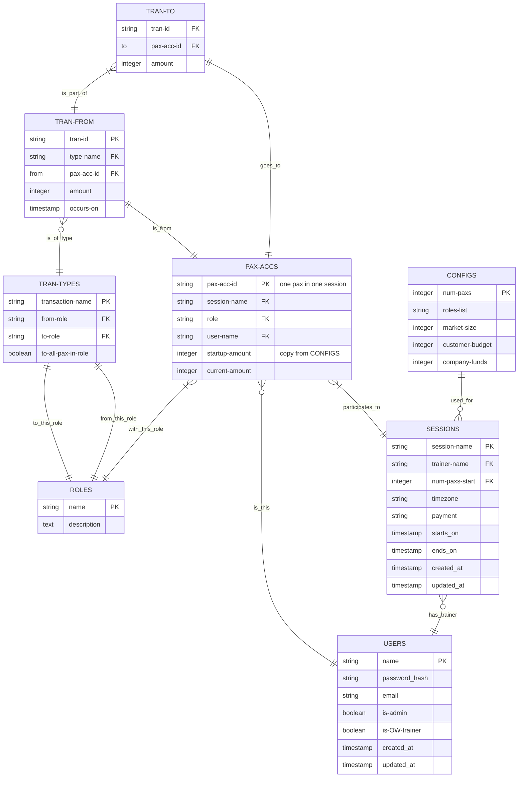

# virtual OW on fastHTML
Version: 0.0.5
Last Updated: 2025-02-02
to see formatted version: Ctrl-K V

## 1. System Overview

The virtual Organization Workshop (vOW) is a web-based application designed for OW trainers to manage distance OW training. Together with a multi-room virtual meeting system like Zoom, the trainer and the participants follow on the web the in-person training developped by Barry Oshry.  The system supports:
- initial configuration of roles and money resilient to participant dropouts
- all financial transactions and reporting
- the production of documents/images by participants with AI assistants or PowerPoint or Google Slides

## 2. Database Design

### 2.1 Entity Relationship Diagram



### 2.2 Table Descriptions

#### Roles Table
Roles for all users
- Primary Key: name (string) "admin, trainer, top, middle, bottom, customer, company, govt"

#### Users Table
Stores user account information and authentication details.
- Primary Key: name (string)
- Foreign Key : role_name references Roles (name)
- Indexes: 
  - email (UNIQUE)

#### Sessions Table
Training session set up by admin for supporting a trainer.
- Primary Key : session-name (string)
- Foreign Keys :
  - trainer-name references Users (name)
  - num-paxs-start references Configs (num-paxs)
 
#### Configs
Initial configuration for paxs number [min: 10, max: 36]
- Primary Key: num-paxs (integer)

#### Pax-accs
One participant in one session with his account
- Primary Key : pax-acc-id (string) "concat.: session name/role/sequence"
- Foreign Keys :
  - user-id references Users (name)
  - session references Sessions (name)

#### Tran-types
Financial transaction types
- Primary Key : transaction-name (string) "cust-payment, salary, bonus"
- Foreign Keys :
  - from-role references Roles (name)
  - to-role references Roles (name)


#### Tasks Table
Stores task information and metadata.
- Primary Key: id (UUID)
- Foreign Keys:
  - creator_id references Users(id)
  - assignee_id references Users(id)
  - team_id references Teams(id)
- Indexes:
  - status, due_date (for filtering)
  - title (for search)

## 3. API Design

### 3.1 Authentication Endpoints

```typescript
// POST /api/v1/auth/register
interface RegisterRequest {
  email: string;
  password: string;
  fullName: string;
}

// POST /api/v1/auth/login
interface LoginRequest {
  email: string;
  password: string;
}
```

### 3.2 Task Management Endpoints

```typescript
// GET /api/v1/tasks
interface TaskQuery {
  teamId?: string;
  status?: TaskStatus;
  priority?: TaskPriority;
  assigneeId?: string;
  dueBefore?: Date;
  dueAfter?: Date;
}

// POST /api/v1/tasks
interface CreateTaskRequest {
  title: string;
  description: string;
  teamId: string;
  assigneeId?: string;
  priority: TaskPriority;
  dueDate: Date;
}
```

## 4. Technical Stack

### 4.1 Backend
- Language: TypeScript
- Framework: NestJS
- Database: PostgreSQL
- ORM: Prisma
- Authentication: JWT + bcrypt

### 4.2 Frontend
- Framework: React
- State Management: Redux Toolkit
- UI Components: Tailwind CSS + shadcn/ui
- API Client: TanStack Query

## 5. Security Considerations

### 5.1 Authentication & Authorization
- JWT-based authentication with refresh tokens
- Password hashing using bcrypt (cost factor 12)
- Role-based access control (RBAC) for team resources
- Rate limiting on authentication endpoints

### 5.2 Data Protection
- All API endpoints are HTTPS-only
- Input validation using Zod schemas
- Prepared statements for database queries
- CORS configuration limited to frontend origin

## 6. Performance Considerations

### 6.1 Database
- Appropriate indexes on frequently queried fields
- Pagination on list endpoints (default limit: 50)
- Optimistic locking for task updates
- Partial indexes for common query patterns

### 6.2 Caching Strategy
- Redis cache for team membership data
- Browser caching for static assets
- API response caching where appropriate

## 7. Monitoring & Logging

### 7.1 Metrics
- Request latency by endpoint
- Error rates and types
- Active users per team
- Task completion rates

### 7.2 Logging
- Structured JSON logging
- Log levels: ERROR, WARN, INFO, DEBUG
- Request correlation IDs
- Sensitive data masking

## 8. Future Considerations

### 8.1 Planned Features
- Task comments and attachments
- Team activity feed
- Email notifications
- Task dependencies

### 8.2 Scalability
- Horizontal scaling of API servers
- Database read replicas
- Task archival strategy
- Webhook integrations