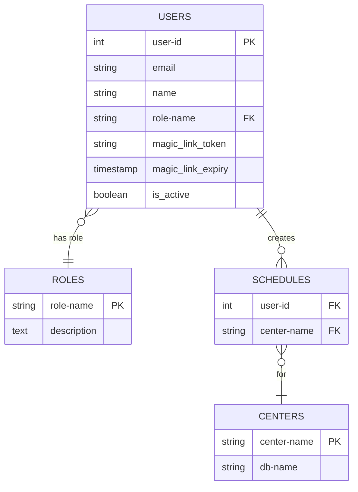

# virtual OW

### Main program

``` {.python file=src\virtualOW.py}

from fasthtml.common import *
# from starlette.testclient import TestClient
import secrets
from datetime import datetime, timedelta

css = Style(':root { --pico-font-size: 90% ; --pico-font-family: Pacifico, cursive;}')

<<auth-beforeware>>

#app, rt = fast_app(live=True, debug=True, before=bware,hdrs=(picolink, css))
app, rt = fast_app(live=True, debug=True, before=bware,hdrs=(picolink,css))

<<setup-database>>
<<authenticate>>
<<dashboard>>

# client = TestClient(app)
# print(client.get("/login").text)

serve()
```

### Database schema 



### Database setup

``` {.python #setup-database}

db = database('data/gongUsers.db')

SQL_CREATE_ROLES = """
CREATE TABLE IF NOT EXISTS roles (
    role_name TEXT PRIMARY KEY,
    description TEXT
);
"""

SQL_CREATE_CENTERS = """
CREATE TABLE IF NOT EXISTS centers (
    center_name TEXT PRIMARY KEY,
    db_name TEXT
);
"""

SQL_CREATE_USERS = """
CREATE TABLE IF NOT EXISTS users (
    id INTEGER PRIMARY KEY AUTOINCREMENT,
    email TEXT NOT NULL,
    name TEXT,
    role_name TEXT,
    magic_link_token TEXT,
    magic_link_expiry TIMESTAMP,
    is_active BOOLEAN DEFAULT FALSE,
    FOREIGN KEY (role_name) REFERENCES roles(role_name)
);
"""

SQL_CREATE_SCHEDULES = """
CREATE TABLE IF NOT EXISTS schedules (
    user_id INTEGER,
    center_name TEXT,
    FOREIGN KEY (user_id) REFERENCES users(id),
    FOREIGN KEY (center_name) REFERENCES centers(center_name)
);
"""

db.execute(SQL_CREATE_ROLES)
db.execute(SQL_CREATE_CENTERS)
db.execute(SQL_CREATE_USERS)
db.execute(SQL_CREATE_SCHEDULES)

users = db.t.users
roles = db.t.roles
centers = db.t.centers
schedules = db.t.schedules

Role = roles.dataclass()
Center = centers.dataclass()
Schedule = schedules.dataclass()
User = users.dataclass()

# Check if ROLES is empty and insert default roles if needed
if not roles():
    roles.insert(role_name="admin", description="administrator")
    roles.insert(role_name="user", description="regular user")

if not centers():
    centers.insert(center_name="Mahi", db_name="mahi")
    centers.insert(center_name="Pajjota", db_name="pajjota")

if not users():
    users.insert(email="spegoff@authentica.eu", name="sp1", role_name="admin", is_active=True, magic_link_token=None, magic_link_expiry=None)
    users.insert(email="spegoff@gmail.com", name="sp2", role_name="user", is_active=True)

if not schedules():
    schedules.insert(users("name='sp1'")[0].id, center_name="Mahi")
    schedules.insert(users("name='sp2'")[0].id, center_name="Pajjota")
```
